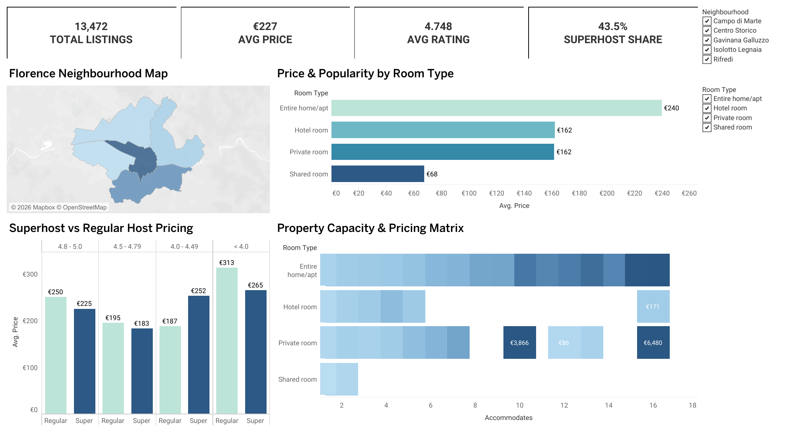

# Florence-Airbnb-Market-Analysis
Interactive Tableau dashboard and market yield analysis of 13,000+ Florence, Italy Airbnb listings.
# 🏙️ Florence Airbnb Market Analysis

An end-to-end data analysis project exploring the Florence Airbnb market, host dynamics, pricing distributions, and neighborhood demand metrics using **Tableau** for data analysis and interactive data visualization.

---

## 📊 Interactive Dashboard Preview



👉 **[View Interactive Dashboard on Tableau Public](https://public.tableau.com/app/profile/magda.maurice/viz/FlorenceAirbnbMarket/FlorenceAirbnbMarket)**

---

## 🎯 Executive Summary & Key Insights

* **Market Scale & Overview:** Florence holds **13,472 total active listings** with an overall average daily rate (ADR) of **€227** and a strong average guest rating of **4.75 / 5.0**.
* **Superhost Footprint:** Superhosts account for **43.5%** of all market listings. Across nearly all rating tiers, Superhosts price their properties slightly lower or on par with regular hosts, driving higher booking volumes and maintaining superior review scores.
* **Pricing by Room Type:** **Entire homes/apartments** dominate total inventory with the highest average price (**€240/night**), followed by **Hotel rooms** and **Private rooms** (**€162/night** each), while **Shared rooms** represent a budget niche at **€68/night**.
* **Spatial Distribution:** Geographic listing density and peak pricing heavily concentrate around **Centro Storico**, with secondary demand radiating outward into **Campo di Marte** and **Rifredi**.

---

## 🎮 Interactive Dashboard Features

* **Global Filters:** Filter dynamic metrics across **Neighbourhood**, **Room Type**, and **Avg. Price** range on the live dashboard to isolate specific micro-markets and budget tiers.
* **Property Capacity & Pricing Matrix:** Analyzes how pricing scales dynamically relative to guest accommodation limits across property types.
* **Superhost vs. Regular Host Comparison:** Categorizes performance and pricing tiers side-by-side across rating brackets ($4.8 - 5.0$, $4.5 - 4.79$, $4.0 - 4.49$, $< 4.0$).

---

## 🛠️ Tools & Technologies Used

* **Data Visualization & Analytics:** Tableau Public
* **Data Compression:** ZIP archive handling
* **Documentation & Version Control:** Markdown, Git, GitHub

---

## 📁 Repository Structure

```text
├── data/
│   └── Florence_Airbnb_Listings.zip   # Cleaned market dataset (compressed CSV)
├── dashboard_preview.png              # Clean export image of the Tableau dashboard
├── Florence_Airbnb_Market.twb         # Tableau Public workbook file
└── README.md                          # Project documentation

---

## 💻 How to Reproduce This Project

1. **Clone and navigate to the repository:**
   ```bash
   git clone [https://github.com/MagdaMaurice/Florence-Airbnb-Market-Analysis.git](https://github.com/MagdaMaurice/Florence-Airbnb-Market-Analysis.git)
   cd Florence-Airbnb-Market-Analysis

2. Extract the dataset:
Unzip data/Florence_Airbnb_Listings.zip to get the raw Florence_Airbnb_Listings.csv file.

3. Open the workbook:
Launch Florence_Airbnb_Market.twb in Tableau Desktop, or view the live interactive version on Tableau Public.
